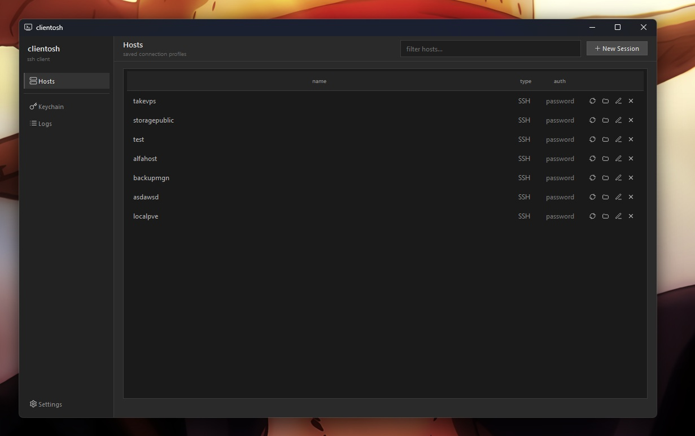
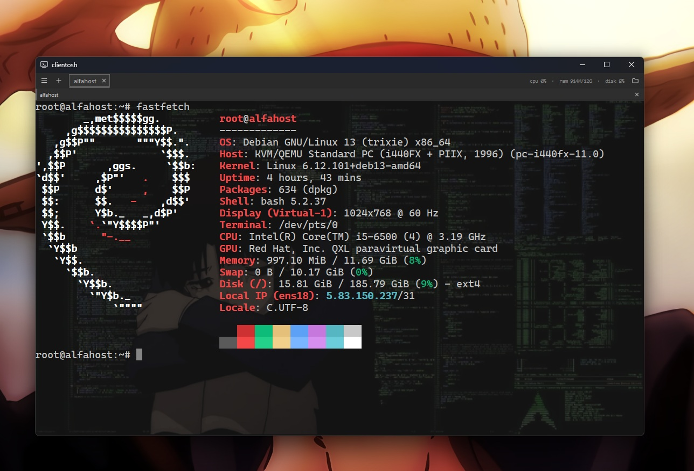
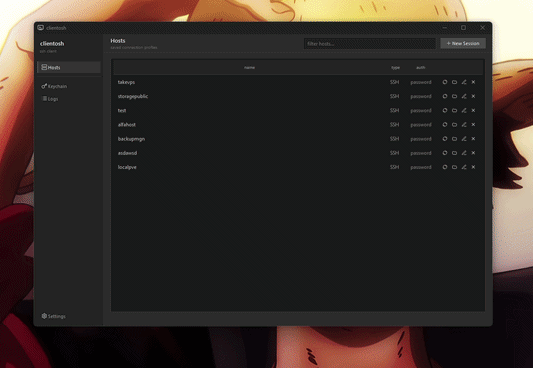
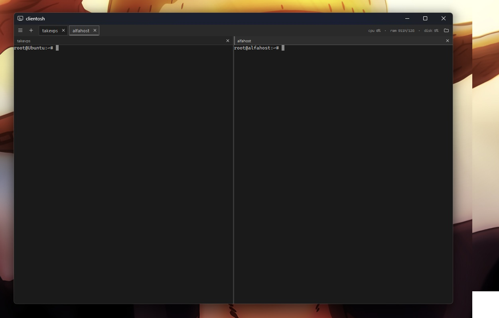
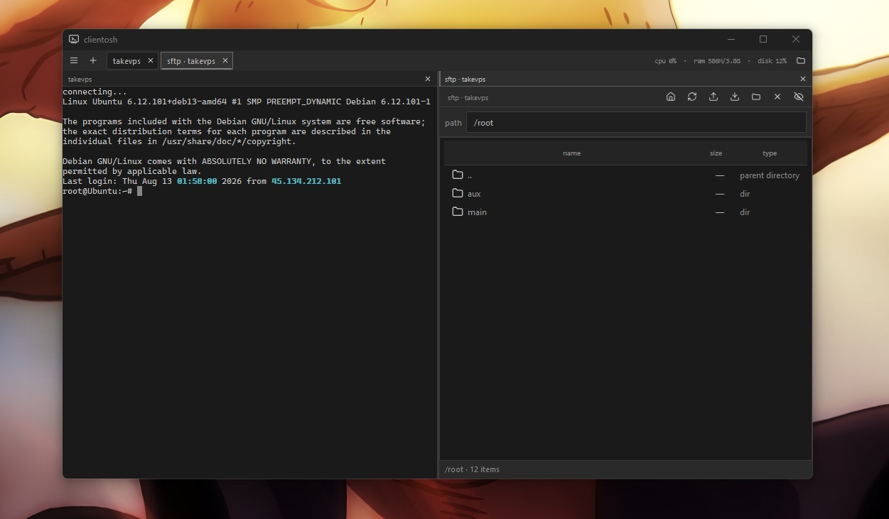

<p align="center">
  
</p>

<h1 align="center">clientosh</h1>

<p align="center">
  <b>A raw, dark-gray SSH client with a split-pane terminal — tired of tab-juggling, made for people who live on the command line.</b>
</p>

<p align="center">
  Terminal and SFTP live side-by-side in a <b>single window</b>. Drag, split, dock, detach. Zero fuss, real SSH.
</p>

<br/>

<p align="center">
  <a href="https://github.com/hdmain/clientosh/releases"></a>
  
  
  
  
</p>

<p align="center">
  
  
  
  
  
  
  
</p>

---

<br/>

## 📸 &nbsp;Showcase

<p align="center"></p>
<p align="center"><em>The dashboard — your launchpad for every session.</em></p>

<p align="center"></p>
<p align="center"><em>A live terminal pane with scrollback, keyword highlighting, and the dark monospace look.</em></p>

<p align="center"></p>
<p align="center"><em>Drag a session chip onto another pane and watch the live split-preview — then drop into any edge.</em></p>

<p align="center"></p>
<p align="center"><em>Two terminals tiled in one window — no separate OS windows to juggle.</em></p>

<p align="center"></p>
<p align="center"><em>Terminal and SFTP file manager docked side-by-side for the same session.</em></p>

<br/>

---

## ✨ &nbsp;Key Features

- **🧱 Split-pane workspace, single window** — drag a session chip onto a live pane to preview the viewport, then drop onto a `Left` / `Right` / `Top` / `Bottom` zone to dock. Terminal **and** SFTP panes share one OS window with animated, eased splitter morphing.
- **🔒 Layer-0 secure vault** — session metadata and secrets are encrypted at rest with **AES-256-GCM** (OpenSSL EVP), backed by your OS keyring: **Windows Credential Manager, macOS Keychain, and Secret Service (libsecret)** — with a machine-bound encrypted-file fallback that keeps things working headless.
- **🗝️ Battle-tested private-key auth** — import and save SSH keys *into the keyring itself*, pick them from a dropdown, and decrypt passphrase-protected keys on the fly. Decrypted payloads are **zeroed in memory** after use.
- **⚡ Non-blocking threading model** — SSH auth, shell I/O, SFTP, and live stats all run on **worker threads**; the GUI never freezes on connect or auth.
- **🖥️ Hand-rolled VT100/xterm emulator** — full scrollback buffer, 256-color + true SGR attributes, alt-screen, mouse reporting & tracking, box-drawing glyphs, DEC character sets, and live keyword/address highlighting — all in pure Qt widgets.
- **📁 Bundled SFTP file manager** — browse, upload, download, and delete remote files for the active session, with details/compact views.
- **🔀 Server-to-server SFTP transfer** — move files **directly between two remote hosts** through a temporary staging area, with per-file progress, verbose logging, and an atomic cancel that cleans up after itself.
- **📊 Live server stats** — per-session CPU / RAM / disk readouts pushed over a dedicated SSH channel on a configurable interval.
- **🪟 Detach & re-attach** — pull a terminal out into its own viewport, then dock it right back into the workspace.
- **🎨 Raw dark UI with motion** — flat, high-contrast monospace theme with subtle eased glows and hover fills (`src/ui/Motion`), plus a light theme, adjustable fonts, and optional blurred background images.
- **🔧 Single-source-of-truth builds** — version bumped once in `project(...)` flows through the About tab, Windows RC resources, NSIS/Inno installers, and package metadata automatically.

> 💡 **What makes clientosh "fast"?** Network I/O never touches the UI thread, the vault decrypts near-instantly via an in-memory machine-bound key (no keyring/DPAPI latency at launch), and animations are vsync-paced with no continuous timers while idle.

<br/>

---

## 🧰 &nbsp;Tech Stack & Architecture

<p align="center">
  
  
  
  
  
  
</p>

| Layer | Technology |
|---|---|
| **Language** | C++17 |
| **UI toolkit** | Qt 6 (`Widgets`, `Network`, `Svg`) |
| **SSH / SFTP** | libssh 2.x |
| **Cryptography** | OpenSSL EVP — AES-256-GCM authenticated encryption |
| **Keyring** | Windows Credential Manager · macOS Keychain · libsecret (dlopen) |
| **Build system** | CMake ≥ 3.21 + Ninja / Unix Makefiles / MinGW Makefiles |
| **Packaging** | CPack (deb/rpm) · Inno Setup · NSIS · dockerized Arch makepkg · AppImage · dmg |
| **CI / CD** | GitHub Actions (matrix: Ubuntu, macOS, Windows-MSYS2), release on `v*` tags |

<br/>

```
                    ┌────────────────────────────────────────────┐
                    │                 MainWindow                 │
                    │   TopNavBar    ┌──── DashboardPage ────┐   │
                    └───────────────┬┴───────────────────────┴───┘
                                    │
                      ┌─────────────▼─────────────┐
                      │      SessionWorkspace      │  split-pane docking
                      │  (QSplitter tree, tiled)   │  drag → edge zones
                      └─────┬────────────────┬────┘
                            │                │
                ┌───────────▼───┐    ┌───────▼──────────┐
                │   PaneFrame    │    │   PaneFrame       │
                │  (Terminal)    │    │   (SftpWindow)    │
                └───────┬───────┘    └───────┬───────────┘
                        │                    │
        ┌───────────────▼───────────────┐   ┌▼─────────────────────────┐
        │        core backend           │   │  SftpClient (worker)     │
        │  SshSession   QThread          │   │  SftpCrossTransfer       │
        │  SessionManager                │   │  (server→server staging) │
        │  ServerStatsClient (worker)    │   │                          │
        │  FontManager                   │   └──────────────────────────┘
        └───────────────┬───────────────┘
                        │
        ┌───────────────▼───────────────┐
        │      VaultManager / Crypto     │  AES-256-GCM at rest
        │      KeyringAdapter            │  CredMgr / Keychain / Secret
        └────────────────────────────────┘
```

**Threading model** — every network concern (auth, shell I/O, SFTP, stats polling) runs on a dedicated worker thread. The GUI thread issues commands and consumes queued signals; it never blocks on a socket.

**Security model** — two encrypted files:
- `connects.json` (fast metadata) is locked with an **in-memory machine-bound key** (SHA-256 of machine-id + per-user scope) for near-instant launch.
- `dbvault` (passwords · passphrases · imported keys) is AES-256-GCM encrypted under a random 256-bit master key persisted in the **OS keyring**, with a graceful file fallback. Both are written **atomically** (temp file + rename) so a crash can never corrupt them.

<br/>

---

## 🚀 &nbsp;Quick Start & Installation

### Requirements

- CMake **≥ 3.21**
- A **C++17** compiler (GCC, Clang, MinGW, or MSVC)
- Qt **6** (`Widgets`, `Network`, `Svg`)
- **libssh** 2.x
- OpenSSL **3** (for the encrypted vault)

### Install dependencies

<details>
<summary><b>🪟 Windows — MSYS2 (MinGW / UCRT64)</b></summary>

```bash
pacman -S mingw-w64-x86_64-gcc mingw-w64-x86_64-cmake \
  mingw-w64-x86_64-qt6-base mingw-w64-x86_64-qt6-svg \
  mingw-w64-x86_64-libssh mingw-w64-x86_64-openssl
```

Or build against an existing pinned Qt install (see *Windows build* below).
</details>

<details>
<summary><b>🐧 Debian / Ubuntu / WSL</b></summary>

```bash
sudo apt install build-essential cmake pkg-config \
  qt6-base-dev libqt6svg6-dev libssh-dev libssl-dev
```
</details>

<details>
<summary><b>🐧 Fedora</b></summary>

```bash
sudo dnf install cmake gcc-c++ qt6-qtbase-devel qt6-qtsvg-devel libssh-devel openssl-devel
```
</details>

<details>
<summary><b>🍎 macOS — Homebrew</b></summary>

```bash
brew install cmake qt libssh openssl@3 pkg-config
```
</details>

### Building

> ⚠️ **Important:** use a **separate build directory per platform**. Reusing a Windows `build/` from WSL (or the reverse) fails because CMake caches generators and paths differ.

**Linux / WSL / macOS**

```bash
cmake -S . -B build-linux -G "Unix Makefiles" -DCMAKE_BUILD_TYPE=Release
cmake --build build-linux -j"$(nproc 2>/dev/null || sysctl -n hw.ncpu || echo 4)"
./build-linux/clientosh
```

If CMake cannot find Qt, point it at the Qt6 include tree:

```bash
cmake -S . -B build-linux -DCMAKE_PREFIX_PATH=/usr   # Debian/Ubuntu (usually /usr)
# or, for a manual Qt build:
cmake -S . -B build-linux -DCMAKE_PREFIX_PATH=/path/to/Qt/6.x/gcc_64
```

**🪟 Windows — Qt + MinGW (pinned Qt 6.9.2)** — the recommended path is the CMake preset, which pins the build to **exactly Qt 6.9.2** plus its matching **MinGW 13.1.0** toolchain and libssh/OpenSSL from MSYS2 — the same set the release CI uses, so the app renders and behaves identically to the released build.

```powershell
cmake --preset windows-qt692-mingw   # Qt 6.9.2 + MinGW 13.1, outputs to build-win/
cmake --build  --preset windows-qt692-mingw
.\build-win\clientosh.exe

# Optional: repackage the installer after a rebuild
& "C:\Program Files (x86)\Inno Setup 6\ISCC.exe" build-win\installer\clientosh_installer.iss
```

> 💡 Build from a shell where the Qt toolchain `bin` is on `PATH`
> (`C:/Qt/Tools/mingw1310_64/bin`); the preset injects it automatically. The Windows build also runs `windeployqt --release` and copies the runtime DLLs (libssh, OpenSSL, MinGW) so the exe is **self-contained**.

### Install the packaged release

| Platform | Artifacts |
|---|---|
| **Linux** | `.deb`, `.rpm`, `.AppImage`, portable `.tar.gz` |
| **Windows** | Inno Setup `.exe`, portable `.zip`, raw `.exe` |
| **Arch** | `.pkg.tar.zst` |
| **macOS** | `.dmg` |

```bash
# Linux — .deb
chmod +x scripts/build-deb.sh
./scripts/build-deb.sh
sudo apt install ./build-deb/clientosh_*.deb
```

<br/>

---

## 🎬 &nbsp;Usage & Examples

### 1. Add a session

From the dashboard, give a session a **name**, **host**, **port**, and **user**. Choose SSH (interactive terminal) or SFTP-only mode.

> By default, saved credentials are *rejected* unless you explicitly opt in to store a password — secrets live only in the encrypted keyring vault, never in plaintext.

### 2. Connect

Authenticate with a **password** or a **private key**. Pick a pre-saved key straight from the keyring dropdown, or point to a key on disk (optionally passphrase-protected).

### 3. Split panes

Drag a session chip onto another pane, hover to preview the split, then drop onto the **Left / Right / Top / Bottom** zone. The splitter animates into place.

### 4. SFTP

Click the folder icon in the top bar to open the file manager for the active session — browse, upload, download, and delete remote files. Dock it beside the terminal for a single-pane workflow.

### 5. Cross-server transfer

When two SFTP sessions are open, move files **between servers** without ever touching your disk's real tree:

```text
[ Server A : /var/www ]  ──download──▶  [ staging/ ]  ──upload──▶  [ Server B : /srv ]
        (worker thread)       per-file progress          (recursive, cancellable)
```

<details>
<summary><b>🔍 Verbose cross-transfer log output</b></summary>

```
[xfer 12:01:03.112] xfer: 3 entries from prod-db -> staging-box:22 staging=…/clientosh_xfer_1
[xfer 12:01:04.001] xfer: file 'backup.sql' isDir=false
[xfer 12:01:05.220] xfer: file 'uploads' isDir=true
[xfer 12:01:05.224] xfer: download failed for 'uploads' err=NO_SUCH_PATH (22) — path not found
[finished] transferred backup.sql
```

Enable verbose mode with **Settings → SFTP → verbose logging**.
</details>

### Keyboard shortcuts (all remappable)

| Action | Default |
|---|---|
| New session | `Ctrl+N` |
| Settings | `Ctrl+,` |
| Dashboard | `Ctrl+Shift+D` |
| Close panel | `Ctrl+W` |
| Open SFTP | `Ctrl+Shift+S` |
| Font bigger / smaller / reset | `Ctrl+=` / `Ctrl+-` / `Ctrl+0` |

<br/>

---

## ⚙️ &nbsp;Configuration

Settings are persisted with Qt's `QSettings` (registry on Windows, INI/plist elsewhere).

| Key | Type | Default | Description |
|---|---|---|---|
| `settings/theme` | `string` | `dark` | `dark` or `light` UI theme |
| `settings/fontSize` | `int` | `11` | Terminal font size in points (9–22) |
| `settings/fontFamily` | `string` | *(auto)* | Monospace terminal face (empty = auto-pick) |
| `settings/terminalFg` / `terminalBg` | `string` | per theme | Terminal foreground / background colors |
| `settings/terminalBgImage` | `string` | — | Optional blurred background image |
| `settings/terminalBgOpacity` / `terminalBgBlur` | `qreal` / `int` | `0.5` / `0` | Background image opacity / blur radius |
| `settings/animationsEnabled` | `bool` | `true` | UI motion + ease transitions |
| `settings/savePasswordDefault` | `bool` | `false` | Default "save password" for new sessions |
| `settings/hideDotfiles` | `bool` | `true` | Hide dotfiles in SFTP browser |
| `settings/statsIntervalSec` | `int` | `2` | Live server-stats polling interval (1–30 s) |
| `settings/showServerStats` | `bool` | `true` | Show CPU / RAM / disk readouts |
| `settings/sftpDefaultView` | `string` | `details` | SFTP view: `details` or `compact` |
| `settings/sftpVerboseLogging` | `bool` | `false` | Verbose cross-transfer logs |
| `settings/highlightAddresses` | `bool` | `true` | Highlight IP/addresses in terminal |
| `settings/highlightLogKeywords` | `bool` | `true` | Highlight log keywords in terminal |
| `settings/ctrlScrollFontZoom` | `bool` | `true` | `Ctrl` + scroll zooms the font |
| `settings/defaultHost` / `defaultUser` / `defaultPort` | — | `127.0.0.1` / — / `22` | Prefill for the new-session dialog |
| `shortcut*` | `string` | see table | Every shortcut + its enable flag |

<br/>

---

## 🗺️ &nbsp;Roadmap

- [x] Split-pane terminal workspace (drag → edge dock)
- [x] OS-keyring-backed encrypted vault + key import
- [x] Hand-rolled VT100/xterm emulator
- [x] Bundled SFTP file manager
- [x] Server-to-server SFTP transfers
- [x] Live server stats polling
- [x] Dark & light themes, fonts, background images
- [x] Cross-distro packaging (deb / rpm / AppImage / Arch / dmg / Inno / NSIS)
- [ ] **Host-key verification** (see security note below)
- [ ] SSH agent forwarding / SOCKS proxy / TCP forwarding
- [ ] Multi-host broadcast / scripted command sender
- [ ] Portable (green) session export/import

<br/>

---

## 🤝 &nbsp;Contributing

Contributions are welcome! Please:

1. **Fork** the repository.
2. Create a feature branch (`git checkout -b feat/my-change`).
3. Keep builds clean on **Linux, macOS, and Windows**.
4. Open a **pull request** against `main`.

The **CI** workflow builds and smoke-tests the project on Ubuntu, macOS, and Windows (MSYS2) for every push and PR. The **Release** workflow produces `.deb`, `.rpm`, `.AppImage`, `.tar.gz`, `.pkg.tar.zst`, Windows installers, and a macOS `.dmg` whenever you push a `v*` tag — plus a `CHECKSUMS.txt`.

> 🔐 **Security note:** host-key checking is intentionally disabled to keep the local client raw and friction-free. Prefer running clientosh on **trusted networks** until key verification (the top roadmap item) lands.

> 💡 **Pro tip:** because the app version lives only in `project(VERSION ...)` at the top of `CMakeLists.txt`, bump it **once** and every artifact — the About tab, Windows RC, and both installers — follows automatically.

<br/>

---

## 📄 &nbsp;License

Released under the [MIT License](LICENSE). © 2026 clientosh contributors.
